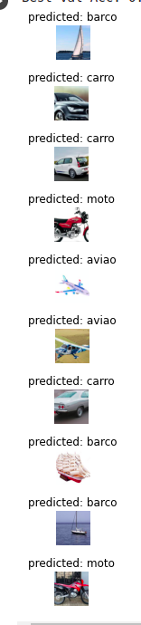

# rede-neurais-auto

# Projeto Final - Modelos Preditivos Conexionistas

### Fábio Vieira de Moura

|**Tipo de Projeto**|**Modelo Selecionado**|**Linguagem**|
|--|--|--|
|Classificação de Imagens|resnet34|PyTorch|

## Performance

O modelo treinado possui performance de 0.975000

### Output do bloco de treinamento

<details>
  <summary>Click to expand!</summary>
  
  ```text
Epoch 0/2
----------
Iterating through data...
train Loss: 1.0378 Acc: 0.5378
Iterating through data...
val Loss: 0.1905 Acc: 0.9250
Epoch 1/2
----------
Iterating through data...
train Loss: 0.5475 Acc: 0.8109
Iterating through data...
val Loss: 0.1911 Acc: 0.9500
Epoch 2/2
----------
Iterating through data...
train Loss: 0.5138 Acc: 0.8193
Iterating through data...
val Loss: 0.0955 Acc: 0.9750    
    
  ```
</details>

### Evidências do treinamento

Nessa seção você deve colocar qualquer evidência do treinamento, como por exemplo gráficos de perda, performance, matriz de confusão etc.

Exemplo de adição de imagem:


## Roboflow

Nessa seção deve colocar o link para acessar o dataset no Roboflow

Exemplo de link: [Nome do link](google.com)

## HuggingFace

Nessa seção você deve publicar o link para o HuggingFace